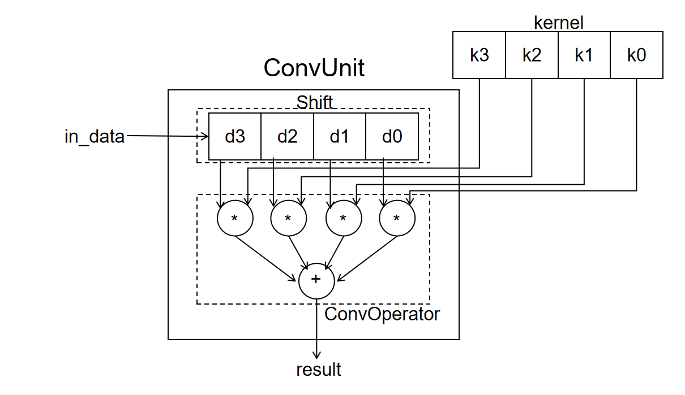

# 实验: 卷积模块

## 实验目的

- 学习使用 SystemVerilog 的 struct、package 等高级语法
- 学习掌握卷积操作的设计和实现
- 学习 valid-ready 的握手协议

## 实验环境

- 操作系统：Windows 10+ 22H2，Ubuntu 22.04+
- VHDL：Verilog，SystemVerilog

## 背景知识

### 卷积操作

#### 基本概念
在泛函分析中，卷积、旋积或褶积（英语：Convolution）是通过两个函数 f 和 g 生成第三个函数的一种数学运算，其本质是一种特殊的积分变换，表征函数 f 与 g 经过翻转和平移的重叠部分函数值乘积对重叠长度的积分。

我们已经实现了加法和乘法的运算，他们是卷积运算的基础。

首先，我们学习一下卷积相关的基本概念，定义一个卷积层需要的几个参数。

- 卷积核大小（Kernel Size）：卷积核大小定义了卷积的视野。2 维中的常见选择是 3 - 即 3x3 像素矩阵。
- 步长（Stride）：步长定义遍历图像时卷积核的移动的步长。虽然它的默认值通常为 1，但我们可以使用值为 2 的步长来对类似于 MaxPooling 的图像进行下采样。
- 填充（Padding）：填充定义如何处理样本的边界。Padding 的目的是保持卷积操作的输出尺寸等于输入尺寸，因为如果卷积核大于 1，则不加 Padding 会导致卷积操作的输出尺寸小于输入尺寸。
- 输入和输出通道（Channels）：卷积层通常需要一定数量的输入通道（I），并计算一定数量的输出通道（O）。可以通过 I * O * K 来计算所需的参数，其中 K 等于卷积核中参数的数量，即卷积核大小。
  
感兴趣的同学可以自行学习卷积的细节。

#### 一维卷积

对于一维的情况，假设卷积核长为 $k$，对应的权重分别是 $[a_0, a_1, a_2, \ldots, a_{k-1}]$。这里要处理的数据长为 $m$，对应的值分别是 $[b_0, b_1, b_2, \ldots, b_{m-1}]$.
那么得到的结果长为 $m-k+1$，对应的值分别是 $[c_0, c_1, c_2, \ldots, c_{m-k}]$，其中 $c_i = a_0b_i + a_1b_{i+1} + a_2b_{i+2} + \ldots + a_{k-1}b_{i+k-1}$.

在本实验中，假设 $m=k=4$，即只需要计算 $c_0=a_0b_0 + a_1b_1 + a_2b_2 + a_3b_3$ 即可。

我们以下面这个例子简单介绍一下一维卷积和实际应用，对上面的学术定义加以阐述。

??? Example "一维卷积"
    例如我们有一组电路会对某个模拟信道的输入进行离散数字电路的采样，在信道稳定的情况下可以得到数据信号`100, 105, 103, 102, 107`。但是因为信道发生了扰动，最后采样得到的信息是`100, 105, 130, 102, 107`，存在明显的异常值，因此采样电路需要一些策略来减少异常值的影响。

    这里提出的策略是，将采样的值和相邻的两个数据取平均作为最后的采样结果。但是对于第一个数和最后一个数缺少相邻的值，因此需要在第一个数据前面补充一个 0，最后一个数据后面补充一个 0，从而确保计算可以执行。然后我们将预先填充的 0，采样得到的 100、105 输入一套电路，这个电路会将 0、100、105 取平均，也就是和 1/3 做加权求和，然后得到输出 68 作为第一个采样的结果。

    <center>
    { width="300" }
    </center>

    然后我们继续采样下一个数据 130，然后将 100、105、130 计算得到的结果。

    <center>
    { width="320" }
    </center>

    最后得到结果：

    <center>
    { width="340" }
    </center>

    可以看到结果的两端填充了 0，中间部分的数据值都变得很相近了。因为采样的序列往往是非常长的，所以这里可以通过电路平滑采样数据，消除边缘奇异点的影响。

    这里的平滑操作本质就是一个卷积操作，采样数据序列就是要被卷积的对象，`(1/3、1/3、1/3)` 的加权求和的权重就是卷积核，加权求和的过程就是卷积运算的过程，边缘填充的 0 就是 padding，处理后得到的结果就是卷积操作的结果。卷积的步长为 1，输入通道为 1，输出通道为 1。

用不同的卷积核可以得到不同的数据后处理效果，例如模糊、锐化、求导等等，在数字信号处理、图像信息处理、数值计算领域有及其重要的应用。下图这个例子是对数据序列 `3, 4, 1, 5, 6` 用卷积核`(-2, 2, 1)`进行输入通道数为 1、输出通道数为 1、步长为 1、两端无数据填充的一维卷积。大家可以自行演算这个样例，加深对卷积的印象。

<center>
{ width="320" }
</center>

### 移位寄存器

移位寄存器序列中，每个寄存器的输入都是上一个寄存器的输出。每个周期使能信号启用之后，除第一个寄存器载入新的值以外，其余寄存器载入上一个寄存器的值。因此，一维卷积操作中的采样数据的存储就可以用用移位寄存器组来实现，如下图。每当新的数据被采样时，移位寄存器更新为新的 3 个相邻数据，然后送为卷积操作模块执行计算。

<center>
{ width="400" }
</center>

??? Note "移位寄存器的用途"
    * 移位寄存器可以用于实现算术运算，比如 C 语言中的移位计算就可以用移位寄存器实现。对于 `a << N` 操作就可以先将数据 a 载入移位寄存器组，然后进行 N 次移位。使用移位寄存器进行移位计算需要的电路开销非常少，只需要若干寄存器和极少数的门电路即可；代价是移位 N 次需要 N 个周期。

        <center>
        { width="400" }
        </center>

    * 移位寄存器可以用于维护数据队列。每次载入一个数据，挤出一个数据，就类似于队列执行一次 `pop_front` 和 `push_back`。而且电路开销非常少。
    * 移位寄存器还用于串行传输。比如我们需要将 8 个 bit 发送给一个外部设备，可以选择并行输入的方式，提供 8 个输出引脚，然后用一个周期发送 8 个 bit，这样需要的传输周期很少，但是输入输出线路开销会很大。另一种是选择串行输入的方式，将数据载入一个 8 位的移位寄存器组，然后只提供一根输出线路，然后用 8 个周期将数据一位一位发送出去，虽然需要花费更多的时钟周期，但是线路开销很小。JTAG、USB、UART、PCIE 等常用设备都是串行传输的，它们的接口电路往往都包含了一组移位寄存器用于串行收发。

        <center>
        { width="400" }
        </center>

对于位宽为 1 的移位寄存器组可以用以下语法快速实现：
```Verilog

    wire in_data;
    reg [3:0] left_shift_reg;
    reg [3:0] right_shift_reg;
    always@(posedge clk)begin
        if(en)begin
            left_shift_reg <= {left_shift_reg[2:0], in_data};
            right_shift_reg <= {in_data, right_shift_reg[3:1]};
        end
    end

```

如果是向量寄存器的移位寄存器组，则要用 `for` 循环等语法实现，例如：
```Verilog

    wire [3:0] in_data;
    reg [3:0] left_shift_reg [3:0];
    reg [3:0] right_shift_reg [3:0];

    integer i;
    always@(posedge clk)begin
        if(en)begin
            for(i=0;i<3;i=i+1)begin
                left_shift_reg[i+1] <= left_shift_reg[i];
            end
            left_shift_reg[0] <= in_data;
        end
    end
    always@(posedge clk)begin
        if(en)begin
            for(i=0;i<3;i=i+1)begin
                right_shift_reg[i] <= right_shift_reg[i+1];
            end
            right_shift_reg[3] <= in_data;
        end
    end

```

### valid-ready 协议

start-finish 协议虽然为调用方和被调用方提供了简单的交互协议，但是在实际应用中存在一定问题。

??? Note "start-finish 协议的缺点"
    * caller 模块无法知道 callee 模块是否处于空闲状态，只能采用保守的策略————当 `finish=1` 之后再次使能 `start` 信号，确保 callee 一定处于空闲状态。这使得 caller 在 `start` 发送到 `finish` 返回的时间区间只能执行一次 callee 调用，但是很多时候 callee 也许可以连续执行多次 caller 调用，因此 caller 期望 callee 可以提供一个信号来表示自己是否空闲。
    * callee 模块无法知道 caller 模块是否准备接受数据，只能采用冒险的策略————当 `finish=1` 的时候，返回数据只保证一个周期有限，默认 caller 会立刻接受返回的计算结果。这要求 caller 的部分组件时刻准备着接收 callee 的结果，不然可能会错过 callee 返回的结果。因此 caller 期望向 callee 提供一个信号来表示自己是否准备就绪，防止 callee 在 caller 接受之前无效掉返回结果。

因此我们提供了 valid-ready 握手协议：

* 对于任何需要被发送的数据组合，发送方提供一个 `valid` 信号，接受方提供一个 `ready` 信号。
* 发送方当数据线上的数据准备就绪的时候将 `valid` 设置为 1，表示发送方数据准备就绪，然后持续等待接收方接收数据。
* 接收方准备接受数据就绪时将 `ready` 设置为 1，表示接收方准备就绪，然后持续等待接收方接收数据。
* 当 `valid=1` 且 `ready=1` 时，本次握手正式完成，在下个时钟上升沿接收方就会载入发送方放置在数据线上的数据。`valid` 信号可以在 `ready` 信号之前、之后或者同时使能，两者保持独立。
    * 握手完成时，接收方必须立刻接收数据线上的数据，如果无法继续接受数据应将 `ready` 设置为 0，如果不想继续接受数据可将 `ready` 设置为 0，如果还能接收数据且愿意接受数据则可以将 `ready` 继续保持为 1。
    * 握手完成时，发送方本次发送的数据已经被接收，此时如果不打算继续发送数据则将 `valid` 设置为 0；如果想继续发送数据则需要立刻撤换数据线上的数据，否则接收方会再次接受原来的数据请求，重复处理。

    ??? Example "valid-ready 握手成功的时序图"
        下面展示了握手成功时的时序图，红线代表此时发送方和接送方握手成功。
        <center>
        { width="450" }
        </center>
        <center>
        { width="450" }
        </center>
        <center>
        { width="450" }
        </center>

        可以看到下图连续四个周期，接收方和发送方完成了四次数据握手传输。

        <center>
        { width="450" }
        </center>

* 需要注意的是：如果握手之后没有及时更换数据线上的数据，就比如下图的例子，data1 的数据就会被传输两次，而 data2 则暂时不会被接收方接受。在接收方视角里，发送方发送了两次数据传递，只不过两次数据的值是一样而已。

    <center>
    { width="450" }
    </center>

* 发送方设置 `valid` 信号和接收方设置 `ready` 本身应该尽量保持独立；特别的，在一些设计规则中，`ready` 信号的设置可以等待 `valid` 信号的设置，但是 `valid` 信号的设置不应该等待 `ready` 信号的设置，防止死锁。

综上，我们可以将 caller 和 callee 之间的 request 和 resp 从原来的 start-finish 协议转换为如今的 valid-ready 协议：

<center>
{ width="480" }
</center>

### 并行加法树

卷积操作需要将 N 个乘积累加起来，例如 `(((num0 + num1) + num2) + num3)`。我们可以用如下电路实现：

<center>
{ width="420" }
</center>

但我们可以看到最长路径的时延是 N-1 个加法器的时延。

考虑到加法具有结合律，因此我们可以将上述算式转换为 `((num0 + num1) + (num2 + num3))`，进而用如下电路加以实现：

<center>
{ width="420" }
</center>

可以看到这是一颗完全平衡树的结构，最长路径是 $\log(N)$ 个加法器的时延，与链式相加相比，不带来额外资源开销，而且可以得到更好的时序性能。

下面给出并行加法树的实现代码，供大家参考：

```SystemVerilog
    Conv::result_t add_tmp [Conv::LEN-1:1] /* verilator split_var */;
    // 下面的 add_tmp[i] = add_tmp[i*2] + add_tmp[i*2+1] 存在 add_tmp <- add_tmp 的数据依赖
    // verilator 的编译器会认为存在自依赖的环形电路，从而报错
    // 因此我们需要用/* verilator split_var */加以修饰，让 verilator 以 add_tmp 的每个 element 为单位做依赖分析

    generate
    // generate 语句除了可以有 for 循环还可以有 if-else，case-default
    for(genvar i=1;i<Conv::LEN;i=i+1)begin
    // genvar 可以在 for 循环内部声明，防止命名空间冲突
        if(i<Conv::LEN/2)begin
            assign add_tmp[i] = add_tmp[i*2] + add_tmp[i*2+1];
            // 加法器的结果输出作为下一级加法器得输入
            // 这些算法参考了数据结构的 heap，大家可以互为参照
        end else begin
            assign add_tmp[i] = stage1_data[(i-Conv::LEN/2)*2] + stage1_data[(i-Conv::LEN/2)*2+1]; 
            // 乘积运算结果两两相加
        end
    end
    endgenerate
```

## 实验步骤

### 实验前准备

与之前的 lab 相同，启动安装在你电脑中的 Ubuntu 22.04 环境（ WSL 或虚拟机），随后通过 `cd` 移动到 `sys1-sp24` 目录下，执行下面的命令：
```shell
git pull origin master
cd repo/sys-project
git pull origin other
```

### 根据包配置电路参数

我们将卷积模块相关的结构和参数定义在 `repo/sys-project/lab4-1/include/conv_struct.vh`的 `Conv` 包中，具体内容如下：

```SystemVerilog
`ifndef __CONV_STRUCT__
`define __CONV_STRUCT__
package Conv;
    parameter WIDTH = 64;   // 单个数据的位宽
    parameter LEN   = 4;    // 卷积核的宽度

    typedef logic [WIDTH-1:0] data_t;       // 计算数据的数据类型
    typedef logic [WIDTH*2-1:0] result_t;   // 计算结果的数据类型

    typedef struct{
        data_t data [LEN-1:0];
    } data_vector;  // 参与卷积计算的数据数组和卷积核对应的数据结构

endpackage
`endif
```

SystemVerilog 的语法参见[附录部分](./lab4-1-appendix.md)。

### 实现卷积单元
参考之前卷积操作的实验原理，我们可以按照如下思路实现一个卷积单元：

* 移位寄存器负责存储所有需要计算的数据 data，kernel 输入是卷积计算的卷积核的权重
* data 和 kernel 的数据送入卷积单元执行加权求和得到卷积结果
* 当需要计算下一个数据的卷积结果的时候，只需要将被卷积的数据序列的下一个数据送入移位寄存器，顶掉最早进入的数据即可

下图是大致的电路图设计，其中移位寄存器的部分我们封装为 `Shift` 模块，卷积运算部分我们封装为 `ConvOperator` 模块：

<center>
{ width="500" }
</center>

`Shift`、`ConvOperator` 模块之间的数据传输， `ConvUnit` 模块和 caller 之间的数据传输都采用 valid-ready 协议。

<center>
{ width="500" }
</center>

请根据上面的原理图和模块间交互关系实现 `lab4-1/submit/ConvUnit.sv` 文件中的 `ConvUnit` 模块。

```SystemVerilog
`include"conv_struct.vh"    // conv 包提供参数和结构的定义
module ConvUnit (
    input clk,
    input rst,
    input Conv::data_vector kernel, // 卷积操作的卷积核
    input Conv::data_t in_data,
    input in_valid,
    output in_ready,    // 输入数据 in_data 和它的握手信号 in_valid-in_ready

    output Conv::result_t result,
    output out_valid,
    input out_ready     // 输出结果 result 和它的握手信号 out_valid-out_ready
);

    // fill the code

endmodule
```

### 实现移位器模块
填写 `lab4-1/submit/Shift.sv` 文件，实现 `Shift` 移位寄存器模块。`Shift` 模块负责载入外部的采样数据并执行移位操作，然后将新的一组数据发送给后端的 ConvOperator 执行卷积运算，如此反复进行。所以 `Shift` 据有两个状态：

* `RDATA`（receive data）：接收数据状态，`Shift` 模块和外部的 caller 握手载入 `in_data` 数据，此时不向后端的 ConvOperator 发送数据。当接收到数据之后进入 `TDATA` 状态。

* `TDATA`（transmit data）：发送数据状态，Shift 模块和后端的 ConvOperator 握手发送数据 `data`，此时不接收来自 caller 的数据。当发送数据之后进入 `RDATA` 状态。

因此可以看到在卷积单元计算出数据的结果之前，`Shift` 模块就已经可以生成下一组待计算数据了，效率比之前的 start-finish 握手要快一些。`Shift` 模块的接口介绍如下：

```SystemVerilog

`include"conv_struct.vh"
module Shift (
    input clk,
    input rst,
    input Conv::data_t in_data,
    input in_valid,
    output reg in_ready,    // 输入数据 in_data 和 caller 的握手信号 in_valid-in_ready

    output Conv::data_vector data,
    output reg out_valid,
    input out_ready         // 输出数据 data 和 ConvOperator 的握手信号 out_valid-out_ready
);

    typedef enum logic {RDATA, TDATA} fsm_state;
    fsm_state state_reg;
    Conv::data_t data_reg [Conv::LEN-1:0];

    // fill the code

endmodule

```

需要注意的是，在我们 4.3 的电路图中，`in_data` 首先进入的是 `data_reg[3]`，然后依次向前移动，最后进入 `data_reg[0]`。

### 实现卷积运算模块

卷积运算模块中的乘法运算单元请使用 `lab3-3/submit/Multiplier.sv` 模块实现。卷积运算模块的运算电路可以参考以下的电路设计：

* `ConvOperator` 输入的 `data` 和 `kernel` 送入乘法器执行乘法操作。
* 在乘法计算结束后，将乘法器输出的结果保存到 `vector_stage1` 寄存器组中，寄存器的 `valid` 设置为 1，表示数据有效。
* `vector_stage1` 寄存器中的结果通过并行加法树累加得到最终结果，保存到 `vector_stage2` 寄存器中，`valid` 设置为 1.
* `vector_stage2` 的内容就是最后的 `result`，通过这个模块的输出端口输出给 caller。

每个阶段开始执行的条件请大家自行思考，这里不再赘述。

<center>
{ width="500" }
</center>

卷积运算模块的有限状态机设计如下：

* `RDATA`（recieve data）：初始状态；数据接收状态，和 `shift` 握手接收数据，接收到数据后进入 `WORK` 状态，并启动乘法器，清空所有 `vector_stage` 中间寄存器的 `valid` 值。
* `WORK`（work）：工作状态，等待乘法器、并行加法器依次执行计算，并把最后的计算结果存入 `vector_stage2` 电路。在 `vector_stage2` 寄存器的 `valid` 信号被设置为 1 之后进入 `TDATA` 状态。
* `TDATA`（tansmit data）：数据发送状态，和 caller 进行握手发送 `result`，发送完毕后返回 `RDATA` 状态。
* 不要忘记 `default` 状态。

以上实现仅供参考，大家可以根据自己的需要随意修改状态机和内部实现。但是不允许直接使用 `*` 乘法算子实现乘法。

模块接口如下：

```SystemVerilog
`include"conv_struct.vh"
module ConvOperator(
    input clk,
    input rst,
    input Conv::data_vector kernel, // 卷积核权重
    input Conv::data_vector data,   
    input in_valid,
    output reg in_ready,            // 和 shift 的握手信号和来自 shift 的 data 数据

    output Conv::result_t result,
    output reg out_valid,
    input out_ready                 // 计算结果 result 和与 caller 的握手信号
);

    localparam VECTOR_WIDTH = 2*Conv::WIDTH;    // result 的位宽
    typedef struct {
        Conv::result_t data;
        logic valid;            // 数据有效
    } mid_vector;   // 中间寄存器的数据结构

    mid_vector vector_stage1 [Conv::LEN-1:0];   // 乘法器结果
    mid_vector vector_stage2;                   // 并行加法树结果

    typedef enum logic [1:0] {RDATA, WORK, TDATA} fsm_state;
    fsm_state state_reg;    // 有限状态机

    // fill the code

endmodule
```

### 仿真

#### 仿真样例生成
在`sim/testbench.v`的仿真激励中生成不少于 16 组随机样例，并且 `in_valid` 信号的激励要满足 valid_ready 协议。

```Verilog
    integer i;
    initial begin
        // fill the testcase
        $display("success!!!");
        $finish;
    end
```

本次的 `Judge.v` 语法过于复杂，感兴趣的同学可以自行阅读。

最后执行 `make verilate`，如果仿真通过最后会输出 `success!!!`，反之就是 `fail!!!` 和报错信息。