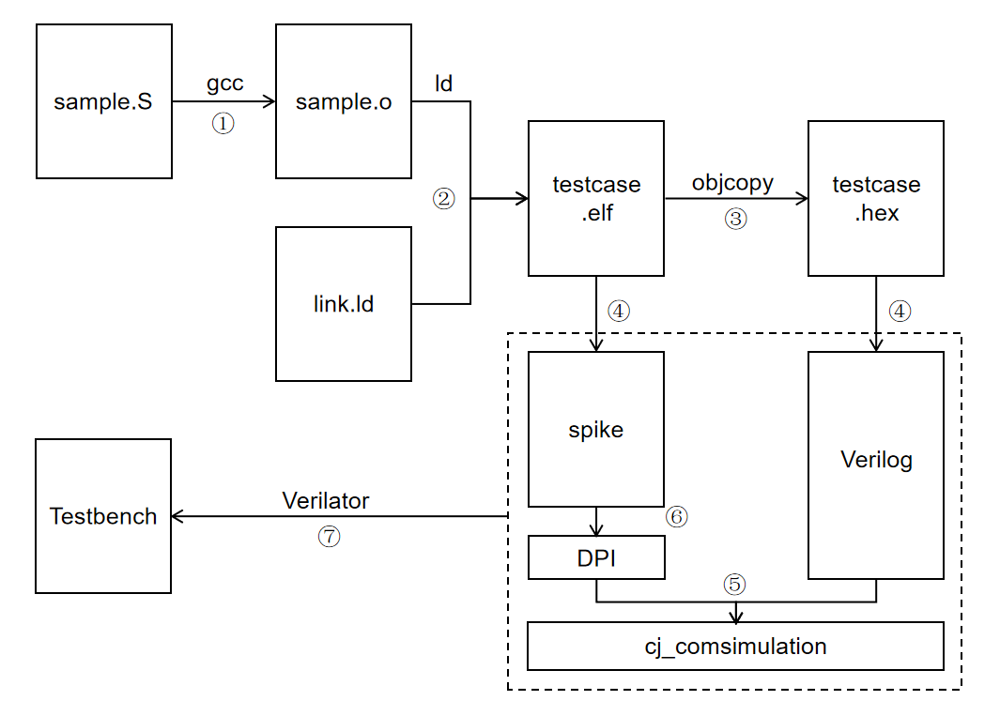

# 处理器差分测试

## 处理器正确性验证

处理器，本质上其实就是一个有限状态机。处理器在架构层面的状态 S 包括 PC 寄存器的状态 $S_{pc}$、寄存器文件的状态 $S_{reg}$、内存的状态 $S_{mem}$，我们可以简单的认为 $S={S_{pc}, S_{reg}, S_{mem}}$ 。只要 $S$ 确定，下个周期得到的 $S'$ 的状态也是确定的，进而整个状态序列都是确定的。因此我们检查一个处理器是否执行正确只要检查所有的状态值寄存器的值是否正确即可。

第一种方法是，每执行一条指令（或者每执行一个周期，在这里是等价的），处理器状态转换变为$S'$，我们将所有 PC、RegFile、Mem 的内部状态 dump 出来，然后和正确执行的结果$S_1'$进行比对，如果每个周期执行之后都保持一致，则可以认为处理器是正确的。不过因为 RegFile 和 Mem 的状态非常庞大，尤其是 Mem，所以在状态比对的时候直接比对 $S'$ 和 $S_1'$ 不太现实，因此可以对比处理器的状态转换 $S \rightarrow S'$ 和正确结果的状态转换 $S_1 \rightarrow S_1'$ 是否一致。

* 在第一个周期，因为初始化的存在，$S$ 和 $S_1$ 都是初始化的全 0 值（**初始化的重要性**）
* 已知$S = S_1$且$S \rightarrow S' = S_1 \rightarrow S_1'$，所以等价于 $S' = S_1'$
* 所以只要处理器执行正确，$S' = S_1'$ 恒成立

$S \rightarrow S'$ 包括该条指令之后 PC 的跳转情况、寄存器的写入情况和内存的写入情况，例如：

* `add x2, x1, x3` 的 $S \rightarrow S'$：
    - PC $\rightarrow$ PC + 4
    - Reg[2] $\rightarrow$ Reg[1] + Reg[3]
    - Mem 状态不变

* `sd x1, 0(x2)` 的 $S \rightarrow S'$：
    - PC $\rightarrow$ PC + 4
    - Reg 状态不变
    - Mem[Reg[2]] $\rightarrow$ Reg[1]

* `jalr x2, 4(x3)` 的 $S \rightarrow S'$：
    - PC $\rightarrow$ Reg[3] + 4
    - Reg[2] $\rightarrow$ PC + 4
    - Mem 状态不变

但是这样存在一些缺点：

* 处理器正确执行的结果需要人工推演，是耗时却容易出错的
* 处理器的状态转换和正确执行的状态转换需要从状态空间中人工提取
* 处理器的状态转换和正确执行的状态转换需要人工比对

我们可以用自动化的方法解决这些问题吗？

## co-simulation 差分测试

处理器正确执行结果的自动推导，我们可以使用 ISA 模拟器来解决，我们这里使用的是 spike 模拟器。我们以 TESTCASE=sample 为例来讲解它的基本流程如下：

* 软件生成部分：

1. 使用 riscv 工具链的 gcc 工具将 sample.S 的汇编文件转换为 .o 文件 sample.o
2. 使用 riscv 工具链的 ld 工具将 sample.o 根据链接脚本 link.ld 的地址空间设置生成可执行程序 testcase.elf（确保可执行程序的地址空间布局和我们处理器的内存地址布局相一致）
3. 使用 riscv 工具链的 objcopy 工具得到 sample.elf 对应的 16 进制内容 sample.hex

* 测试执行部分：

4. 将 testcase.elf 载入我们的模拟器 spike，等待被调用；将 testcase.hex 的内容载入到处理器 Verilog 的 mem 内存中
5. 模拟执行 Verilog 描述的处理器，每执行一个时钟周期（或者说执行一条指令）可将处理器的状态变化发送给差分测试模块 cj_comsimulation 进行差分测试
6. cj_comsimluation 模块通过 DPI 接口调用 spike 的接口，然后 spike 会模拟执行一条指令，并将执行结果和 cj_comsimulation 提供的处理器执行结果相比对。如果执行结果不一致则会报错，从而发现 error

* 测试环境编译部分：

7. 在 spike 的基础上扩展为了 co-sim 工具，然后编译为静态链接库，保存在 ip 文件夹下
8. cj_comsimulation 和处理器使用 Verilog 编写，然后通过 DPI 接口调用 co-sim 的差分测试功能，使用 Verilator 工具将 Verilog 编译为 cpp 文件
9. 编译连接这些 cpp 和 a 文件得到最后的测试程序 Testbench，然后执行差分测试即可



## cj_comsimulation 测试细节

为了测试 PC 状态的变化，处理器的 cosim_core_info 提供当前模拟指令的 pc 和 inst，然后调用 cosim_commit 函数比较 spike 模拟得到的指令的 pc 和 inst 是否一致，如果保持一致则 PC 寄存器的状态变化正确。

为了测试 reg 寄存器状态的变化，处理器的 cosim_core_info 提供当前模拟指令的 we、rd、wdata，即是否修改寄存器、写回寄存器地址、写回寄存器的值，然后调用 cosim_judge 函数比较 spike 模拟得到的寄存器修改情况是否一致，如果一致则 reg 寄存器状态变化正确。

内存状态变化因为外围的内存操作过于复杂，所以没有做检查，默认内存变化都是正确的。sd 指令的操作往往以来之后 ld 指令访问同一个内存的时候，检查写回寄存器的结果来进行判断。

```Verilog
reg error1=1'b0;
  reg error2=1'b0;
  always@(posedge clk) begin
    if (rstn != `BSV_RESET_VALUE) begin
        if(cosim_valid)begin
          if (cosim_commit(0, cosim_pc, cosim_inst) != 0) begin
            $display("[CJ] %d Commit Failed", 0);
            error1=1'b1;
          end
          if (cosim_we) begin
              if (cosim_judge(0, "int", {27'b0,cosim_rd}, cosim_wdate) != 0) begin
                $display("[CJ] %d int register write Judge Failed", 0);
                error2=1'b1;
              end
          end
        end else begin
          // $display("[CJ] nop instruction");
        end
      end
  end
```

更多细节请阅读代码仓库 [https://github.com/sycuricon/riscv-isa-cosim.git](https://github.com/sycuricon/riscv-isa-cosim.git) 和论文 [MorFuzz: Fuzzing Processor via Runtime Instruction Morphing enhanced Synchronizable Co-simulation](https://www.usenix.org/conference/usenixsecurity23/presentation/xu-jinyan)