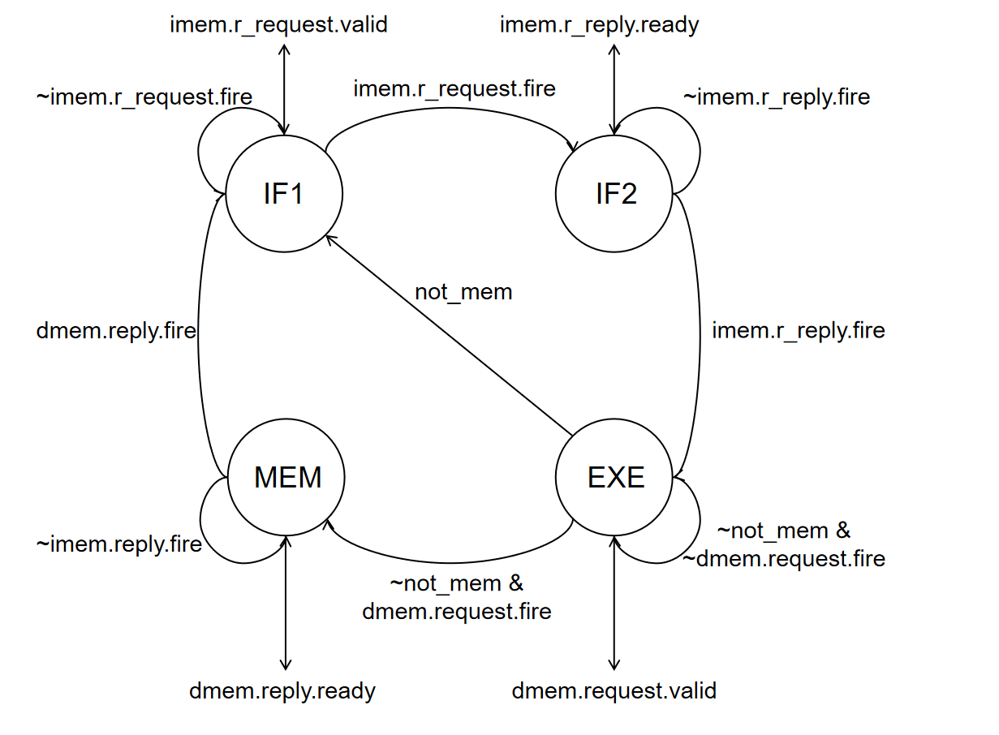
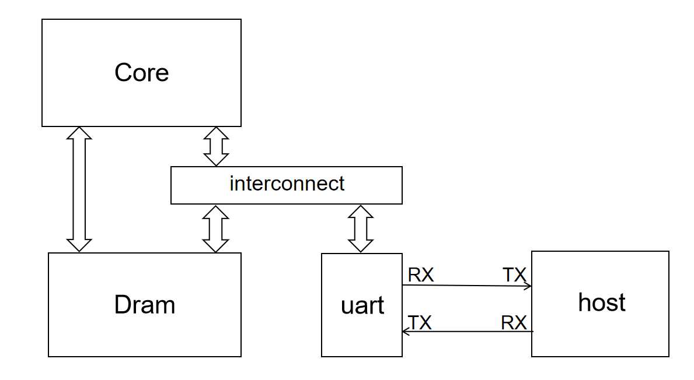

# project：多周期处理器

## 实验目的

- 尝试实践内存总线握手协议
- 学习实践多周期处理器的控制状态机设计方法
- 学习实践 mmio 的外设管理方法和串口驱动

## 实验环境

- 操作系统：Windows 10+ 22H2，Ubuntu 22.04+
- VHDL：Verilog，SystemVerilog

## 背景知识

### Memory 接口

我们在本次实验中提供了一个相对较为复杂且完备的 Memory 接口。该接口可以支持多周期内存读写、错误反馈，便于各类外设接口的扩展，目前已被应用于内存访问和串口访问。

Memory 接口由四个数据通道组成：

* 读请求通道：该通道线路相互配合，将 Core 的读请求发送给 Memory
  - r_request_bits：类型 RrequestBit，为读请求的数据包
    - raddr：类型 addr_t，为需要读的内存地址
  - r_request_valid：类型 ctrl_t，Core 和 Memory 关于 r_request_bits 的握手信号
  - r_request_ready：类型 ctrl_t，Core 和 Memory 关于 r_request_bits 的握手信号
* 读响应通道：该通道线路相互配合，将 Memory 读到的结果返还给 Memory
  - r_reply_bits：类型 RreplyBit，为读响应的数据包
    - rdata：类型 data_t，为读到的内存数据
    - rresp：类型为 resp_t，为内存访问过程中的报错信息
  - r_reply_valid：类型 ctrl_t，Core 和 Memory 关于 r_reply_bits 的握手信号
  - r_reply_ready：类型 ctrl_t，Core 和 Memory 关于 r_reply_bits 的握手信号
* 写请求通道：该通道线路相互配合，将 Core 的写请求发送给 Memory
  - w_request_bits：类型 WrequestBit，为写请求的数据包
    - waddr：类型 addr_t，为需要写的内存地址
    - wmask：类型为 mask_t，为写操作的字节掩码
    - wdata：类型为 data_t，为写入的数据
  - w_request_valid：类型 ctrl_t，Core 和 Memory 关于 w_request_bits 的握手信号
  - w_request_ready：类型 ctrl_t，Core 和 Memory 关于 w_request_bits 的握手信号
* 写响应通道：该通道线路相互配合，将 Memory 写的结果返还给 Memory
  - w_reply_bits：类型 WreplyBit，为写响应的数据包
    - bresp：类型为 resp_t，为内存访问过程中的报错信息
  - w_reply_valid：类型 ctrl_t，Core 和 Memory 关于 w_reply_bits 的握手信号
  - w_reply_ready：类型 ctrl_t，Core 和 Memory 关于 w_reply_bits 的握手信号

当进行读操作的时候，首先通过读通道的握手，Master 将读请求的内容发送给 Slave，然后等待 Slave 通过读响应通道的握手，将读操作的结果反馈给 Master；写操作同理，Master 通过写请求通道握手发送请求内容，然后等待写响应握手得到 Slave 写的结果。

### 内存总线握手协议

在真实的计算机系统中，我们会有各种的主设备和从设备，主设备向从设备发出读写请求，然后获得读写结果。主设备和从设备的种类数多种多样的，常见的主设备有处理器核心，常见的从设备有内存、串口等，甚至有些设备既可以作为主设备、也可以作为从设备，比如显卡、网卡、总线互联等。各类设备的工作模式、硬件实现、内部协议都是互不相同甚至大相径庭的，如果我们为任何一个主从设备都定制专门的连接，这个设计开销是巨大的，所以我们定义了总线协议和总线接口。主设备实现遵守总线协议的主总线接口，从设备实现遵守总线协议的从总线接口，这样任何主从设备之间都可以直接用总线串联，然后正常工作。

我们介绍一下 mem_ift 的总线握手协议，让同学们对于总线协议有一个简单的认识，实际使用的总线协议因为实际需求更多，所以会有更复杂的实现和更强大的功能。

* 读请求：
    1. Master 设备将要访问的地址放到 r_request_bits.raddr 上，待地址数据稳定后，将 r_request_valid 设置为 1
    2. Slave 设备在可以接受读请求的时候将 r_request_ready 设置为 1
    3. 当 r_request_valid & r_request_ready 的时候，说明握手成功

    4. Master 发送请求成功，关闭请求或者发送下一个请求，在可以接受读返回数据之后，将 r_reply_ready 设置为 1
    5. Slave 接收到 Master 的请求之后根据 r_request_bits.raddr 的地址获得对应的数据，然后放置到 r_reply_bits.rdata 上，如果访问成功将 r_reply_bits.rresp 设置为 OKAY，反之设置为 SLVERR。待数据稳定后，将 r_reply_valid 设置为 1
    6. 当 r_reply_valid & r_reply_ready 的时候，说明握手成功

    7. Master 接收 Slave 返回的结果，关闭 ready 或者等待接收下一个返回结果
    8. Slave 关闭数据响应或者准备发送下一个读请求的结果

* 写请求：
    1. Master 设备将要写入的地址、数据、字节使能放到 w_request_bits.waddr、wdata、wmask 上，待地址数据稳定后，将 w_request_valid 设置为 1
    2. Slave 设备在可以接受写请求的时候将 w_request_ready 设置为 1
    3. 当 w_request_valid & w_request_ready 的时候，说明握手成功

    4. Master 发送请求成功，关闭请求或者发送下一个请求，在可以接受读返回数据之后，将 w_reply_ready 设置为 1
    5. Slave 接收到 Master 的请求之后根据 w_request_bits.waddr、wdata、wmask 进行对应的写操作，如果地址合法且写入成功将 w_reply_bits.rresp 设置为 OKAY，反之设置为 SLVERR。待数据稳定后，将 w_reply_valid 设置为 1
    6. 当 w_reply_valid & w_reply_ready 的时候，说明握手成功

    7. Master 接收 Slave 返回的结果，关闭 ready 或者等待接收下一个返回结果
    8. Slave 关闭数据响应或者准备发送下一个写请求的结果

简单来说，Master 和 Slave 通过 request 通道握手，Master 将 request 的信息发送给 Slave；然后再通过 reply 通道握手，Slave 将 reply 的信息发送给 Master。Read 和 Write 的通道可以简单地认为相互不影响。需要注意，在没有发送 request 请求之前，理论上不应该有 reply 响应。

Slave 发送 request 的请求之后，Master 一般至少下一个周期才可以返回 reply 结果，所以在内存总线的场景下处理器的一次内存访问是多周期的，最少一个周期的 request、一个周期的 reply。但是实际上 Slave 和 Master 的 request 握手本身可能需要若干个周期，Slave处理数据内容也需要大量周期，最后 Slave 和 Master 的 reply 握手又需要大量的周期，这就导致实际上一次内存访问需要几十甚至上百周期。

实际上内存访问多周期并不是总线引入的，而是 Slave 设备本身引入的，比如我们的 core 如果不用专门定制的（实际不存在的）dram 进行一周期的读写操作，而是用常见的 sram 或者 ddr，则可能需要 10-50 个周期才可以获得一次数据。因为内存总线的存在恰恰使得 Slave 设备的访问控制变得简单，我们可以忽略每个设备复杂的驱动协议，仅仅通过总线握手和等待就可以得到正确的执行结果。

### 多周期处理器

真实的处理器在处理一条指令的时候，取指、译码、执行、访存、写回的每个操作可能都需要很多个时钟周期。例如取指和访存操作需要访问内存，而内存访问需要总线握手和内存处理，可能要等待几十个到上百个周期；译码如 x86 需要作微码转换、解码等操作，又需要很多周期；执行简单的指令如加法、移位可能只需要一个周期，但是复杂的指令操作如乘法、除法、同步等需要几十上百个周期；写回有时候可能也要多周期。所以处理器的一条指令分多个周期执行完成是很正常。

为了让处理器可以有条不紊的用多个周期处理一条指令，我们需要设计一个控制多周期处理器工作的有限状态机，它可以在不同的状态控制不同的处理器部件工作，以确保指令正确执行，各个部件不冲突。本实验的指令除了访存都只需要执行一个周期，所以我们可以简单设计如下的有限状态机：

* IF1：发送 imem 内存的读请求，等待读请求握手达成。握手成功进入 IF2 状态
* IF2：等待 imem 内存的读响应，等待读响应握手达成。握手成功，获得待执行的指令，进入 EXE 状态
* ID-EXE：对指令译码，如果不是访存指令，就执行计算并写回计算结果，进入 IF1 状态，开始执行下一条指令；如果是访存指令，发送 dmem 内存的读写请求，等待读写请求握手达成，握手成功进入 MEM 状态
* MEM：等待 dmem 的读写相应，握手成功将读到的数据写入寄存器组，然后返回 IF1 状态开始执行下一条指令



所以如果我们想在单周期处理器的基础上实现多周期处理器，需要进行如下的修改：

* 设置一个有限状态机，做状态的转换
* 增加新的控制信号或者修改控制信号
    - stall 信号，当一条指令没有执行完毕时，PC 保持不变
    - we_reg 信号，当一条指令没有执行完毕时，寄存器组不写回
    - mem_ift 信号，在不同的接口发送不断的请求、响应握手信号
* 增加中间寄存器，保存必要的结果
    - inst 寄存器，当 imem 响应实现时将返回的 inst 写入寄存器
* 其他有必要的修改

可以参考`submit/Core.sv`的 MultiFSM 的模块接口实现对应的有限状态机和控制信号。

```SystemVerilog
module MultiFSM(
    input clk,
    input rst,
    Mem_ift.Master imem_ift,
    Mem_ift.Master dmem_ift,
    input we_mem,
    input re_mem,
    input CorePack::addr_t pc,
    input CorePack::addr_t alu_res,
    input CorePack::data_t data_package,
    input CorePack::mask_t mask_package,
    output stall
);
    import CorePack::*;

    // fill your code for bonus

endmodule
```

### memory-mapping I/O

我们之前提到，在一个体系结构中，处理器核心有多个从设备可以读写访问，比如内存、串口、加速器、PCIE 设备等等。对于内存，我们可以用 load-store 指令直接访问，但是对于串口等 IO 设备我们要怎么进行读写操作呢？

在 x86 等指令集中有特定的 in-out 指令，并且给每一个外设的可编程寄存器提供了专门的编号，然后就可以用`in/out ID`的形式来访问这些寄存器。因此 x86 有针对内存的 load-store 指令，同时兼有针对 IO 的 in-out 指令。但是这样就需要管理两套设备访问指令，无论是设备提供商还是软件开发者都是比较繁琐的。riscv 则采用 memory-mapping 的方式来解决这个问题。

in-out 是为每一个 IO 的可编程寄存器提供了一个编号进行访问，memory-mapping 则是从物理地址中划分了一部分，然后作为这些寄存器的地址。只要用 load-store 指令访问这些特殊的地址，就可以读写对应的 IO 寄存器，从而实现读 IO 的输入、提供 IO 的输出、设置 IO 的状态等一系列功能繁复的操作。memory-mapping I/O 的 load-store 读写的地址并不一定是真正的存储单元，可能是任何有效的硬件实现，具体的使用还是要看设备提供商提供的操作手册。

在本实验中，我们将串口封装为一个从设备，然后将它的状态、数据管理抽象为可编程读写接口：
    * 0x10000000-0x10000001：串口数据寄存器，宽度一字节。读这个寄存器可以得到串口接收到的字符：写这个寄存器可以让串口发送写入的字符。因为数据寄存器只有 8 位，所以写入的数据只有低八位有效；读到的数据是 8 位数据，然后高位零扩展。
    * 0x10000001-0x10000002：串口状态寄存器，宽度一字节。读这个寄存器可以得到串口的工作状态：读到数据的最低位是 TX 的工作状态，如果是 1，则可以发送数据，如果是 0，则串口发送端处于繁忙；读到数据的次低位是 RX 的工作状态，如果是 1，则可以接受数据，如果是 0，则没有数据被接受。
    * 如果读写的地址不合理，或者读写的时候 TX、RX 没有就绪，串口会返回 SLVERR 报告

我们来查看一个当前 SoC 的外围设计：



imem_ift 总线接口直接直连到 dram 的一号口，dmem_ift 总线经过 interconnect 的路由，根据输入地址的不同访问内存或者串口，物理地址分布如下：

* 0x00000000 - 0x00001000：dram 地址范围，仅在该地址范围访问内存有效
* 0x10000000 - 0x10000100：uart 地址范围，该范围仅 0x10000000-0x10000002 有效，其他访问返回 SLVERR
* other：无效地址范围，访问返回 DECERR

memory-mapping 根据地址访问各种不同的从设备依赖于复杂的 interconnection 连接来实现。

## 实验步骤

### 实验前准备

与之前的 lab 相同，启动安装在你电脑中的 Ubuntu 22.04 环境（ WSL 或虚拟机），随后通过 `cd` 移动到 `sys1-sp24` 目录下，执行下面的命令：
```shell
git pull origin master
cd repo/sys-project
git checkout multicycle
```
该实验的 sys-project 代码在 multicycle 分支下。

### 实现多周期 CPU

根据"多周期处理器"一节实现`submit/Core.sv`的 MultiFSM 模块，并修改 core 的细节，将 core 转换为可以顺利执行的多周期处理器（这里已经帮大家实现了，非访存指令为 3 周期，访存指令为 4 周期）。之后执行`make verilate TESTCASE=full`，仿真测试，如果顺利结束可以证明执行正确。

然后执行`make board_sim TESTCASE=full`得到用于下板的执行文件 testcase.hex，然后修改`include/initial_mem.hex`的 FILE_PATH，用该 hex 修改处理器的内存的值。

### 执行串口收发

之前我们用回环测试的模块实现了串口收发，现在我们用处理器执行程序的方式来实现串口收发。请实现在`sys-project/testcode/testcase/uart`中的函数 uart_tx 和 uart_rx，只要在 project 目录下执行`make uart`就可以编译该文件夹下的代码得到 testcase.hex，然后用该程序进行仿真测试。为了验证串口收发的正确性，我们在`sys-project/sim`提供了 sim_uart.sv 模块用于模拟 host 的串口收发，我们的处理器会和 host 共同实现回环测试。

