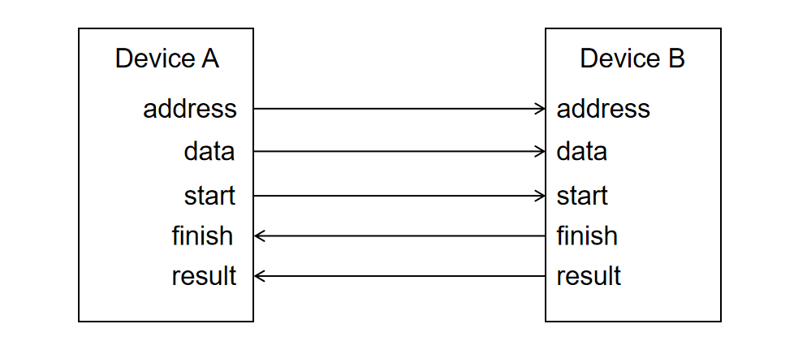

# SystemVerilog 高级语法

为了对 lab4 进行快速开发，我们会介绍一些 SystemVerilog 特有的语法，以提高开发效率。其中 `typedef`, `struct`, `package`, `queue` 会在 lab4-1 中用到，`interface` 语法会在 lab4-2(bonus) 中用到，同学们可以按需阅读。

## typedef

在 ConvOperator 中被计算的数据是 WIDTH 位的，计算得到的数据是 WIDTH*2 位的，因此每当我们为被计算数据提供变量是就要用数据类型`logic [WIDTH-1:0]`，对计算结果设置变量的时候就要使用数据类型`logic [2*WIDTH-1:0]`。这会产生三个问题：

* 数据类型的声明是比较繁琐和耗时的
* 因为它只是一个无其他语义信息的线宽类型，容易因为线宽写错而引入错误
* 如果我们需要修改被计算数据和计算结果的数据类型（例如需要修改线宽，比如结果的宽度不是数据的两倍，比如结果的数据类型复杂到不是单个变量可以表示的），就要手动注意修改有冲突的数据类型

因此我们可以用 typedef 关键字将无语义信息的数据类型等转换为有语义信息的数据类型，比如将计算数据使用的数据类型`logic [WIDTH-1:0]`定义为类型 data_t，计算结果使用的数据类型`logic [2*WIDTH-1:0]`定义为 result_t：

* data_t 和 result_t 比`logic [WIDTH-1:0]`、`logic [2*WIDTH-1:0]`更简短
* data_t 和 result_t 有丰富的语义信息，计算数据变量使用 data_t 类型，计算结果变量使用 result_t 类型
* 如果变量类型需要修改，只要修改 typedef 后面的变量类型即可，外部类型就不需要手动修改了

```SystemVerilog
    parameter WIDTH = 64;
    parameter LEN   = 4;

    typedef logic [WIDTH-1:0] data_t;
    typedef logic [WIDTH*2-1:0] result_t;
```

typedef 重定义类型都是 logic 类型的，而不是 wire 或者 reg。logic 类型会根据自己被使用的环境选择被转换为 wire 实现还是 reg 实现，因此 logic 本身既可以作为 wire 使用也可以作为 reg 使用。

## struct

我们参考下面这段代码。我们的 ConvOperator 模块将 4 个 64 位的 kernel 数据和 4 个 64 位的 data 数据做卷积运算。因为模块的输入端口不支持二维数据，因此我们需要在 ConvOperator 的输入输出中提供 8 个数据的输入。为 ConvOperator 提供输入的模块也要对应的提供 8 个数据输出，为了传递这一大组数据既是繁琐的，又容易因为写漏写错而发生 error。如果我们可以将这些数据打包成一个整体进行传输，就可以很好的解决这一问题。

```SystemVerilog
module ConvOperator(
    input clk,
    input rst,
    input [63:0] kernel_0,
    input [63:0] kernel_1,
    input [63:0] kernel_2,
    input [63:0] kernel_3,
    input [63:0] data_0,
    input [63:0] data_1,
    input [63:0] data_2,
    input [63:0] data_3,
    input in_valid,
    output reg in_ready,

    ...
```

SystemVerilog 借鉴 C 语言的 struct 语法提供了自己的 struct 语法，例如我们可以将卷积核和数据打包为 data_vector 结构。这里我们定义了结构的内容是`data_t data [LEN-1:0]`，是一个 data_t 数组。

```SystemVerilog
    parameter WIDTH = 64;
    parameter LEN   = 4;

    typedef logic [WIDTH-1:0] data_t;
    typedef logic [WIDTH*2-1:0] result_t;

    typedef struct{
        data_t data [LEN-1:0];
    } data_vector;
```

于是当我们在 ConvOperator 输入输出 kernel 和 data 的时候就可以将 kernel 和 data 打包为 data_vector 数据类型，于是其输入输出可以修改为如下形式，端口的语法是`input/output struct类型 端口名`。

* 使用结构可以在数据传输的时候减少端口声明和端口赋值的代码量，还可以防止连线错误
* 通过修改 LEN 变量的大小就可以修改传入模块的向量变量个数，而无需手动修改端口
* 修改 struct 的定义就可以修改输入输出的子成员内容，而不需要修改接口和接口连接

```SystemVerilog
module ConvOperator(
    input clk,
    input rst,
    input data_vector kernel,
    input data_vector data,
    input in_valid,
    output reg in_ready,

    ...
```

之后模块输入输出的结构端口可以直接用结构变量进行连接，数据可以一步到位，而不需要分别连接各个子部份。

```SystemVerilog
module m0(
    ...
    output data_vector data // 结构作为输出
);

module m1(
    ...
    input data_vector data  // 结构作为输入
);
module m3;
    data_vector data;
    m0 m0_0(
        ...
        .data(data)
    );
    m1 m1_0(
        ...
        .data(data)
    );                      // 模块间结构传递
endmodule
```

结构的成员可以是 logic，可以是 logic 向量，可以是 logic 高维数组，可以是其他结构、枚举。数据的组合非常的自由。可以用如下语法定义结构、结构数组、结构高维数组等。

```SystemVerilog
    typedef struct {
        logic a;                // logic
        logic [3:0] b;          // logic 向量
        logic [3:0] c [3:0];    // logic 高维数组
        fsm_state state;        // 枚举
        data_vector data;       // 结构
    } s0;

    s0 s1;                      // 结构变量
    s0 s2 [3:0];                // 结构数组
    s0 s3 [3:0][3:0];           // 结构高维数组
```

结构变量之间可以直接赋值，可以用`.`运算符访问结构的成员变量，然后对成员变量赋值或者给其他成员赋值。

也可以用`'{key1:value1, ... ,keyN:valueN}`直接给结构的所有成员变量对应赋值。

结构可以用`?:`进行选择

```SystemVerilog
    typedef struct{
        logic a;
        logic [3:0] b;
    } s0;
    s0 s1,s2,s3,s4;
    logic a1,a2;
    logic [3:0] b1;

    assign s1 = s2;     // 结构直接赋值
    assign s2.a = a1;   // 结构成员赋值
    assign s2.b = b1;
    assign a2 = s1.a;   // 用结构成员给其他变量赋值
    assign s3 = '{a:a1, b:b1};  // 对所有结构成员依次赋值

    assign s4 = a1?s1:s2;   // 结构的选择 
```

## package

如果我们需要使用 data_vector 结构，就要首先定义 data_vector 结构。但是如果 struct 只能定义在 module 中，我们怎么才能让 module 的输入输出端口也使用 data_vector 结构？怎么才能让不同模块使用相同的 data_vector 结构呢？

SystemVerilog 提供了 package，我们可以在 package 中定义各种需要的参数 parameter、类型 type、结构 struct、枚举 enum、函数 function 等。例如我们在`sys-project/lab4-1/include/conv_struct.vh`用`package 包名; ... endpackage`定义了 Conv 包，然后在包中定义了参数 WIDTH、LEN，类型 data_t、result_t，结构 data_vector。

```SystemVerilog
package Conv;
    parameter WIDTH = 64;
    parameter LEN   = 4;

    typedef logic [WIDTH-1:0] data_t;
    typedef logic [WIDTH*2-1:0] result_t;

    typedef struct{
        data_t data [LEN-1:0];
    } data_vector;

endpackage
```

我们在其他模块中就可以使用 Conv 定义的参数、类型、枚举、结构、函数，例如`Conv::data_t`就是 Conv 中定义的 data_t 变量，`Conv::data_vector`就是 Conv 中定义的 data_vector 结构。

```SystemVerilog
module ConvOperator(
    input clk,
    input rst,
    input Conv::data_vector kernel,
    input Conv::data_vector data,
    input in_valid,
    output reg in_ready,

    output Conv::result_t result,
    output reg out_valid,
    input out_ready
);
```

在模块内部如果不希望反复使用`Conv::`来指示 Conv 包内部的变量名，可以使用语句`import Conv::result_t`，将命名 result_t 引入该模块的命名空间，则之后在模块中使用 result_t 就是在使用 Conv 的 result_t，而不需要额外的`Conv::`修饰了。如果希望引入 Conv 内部的所有定义，可以使用`import Conv::*`来实现。

理论上只要我们将 Conv 包加入工程就可以引用 Conv 包定义的内容，但是在实际综合或者仿真的时候，编译器对文件是逐个解析的，如果先解析使用 Conv 内容的模块文件，在解析 Conv 包文件就会出现 Conv 内容找不到的报错。如果运气好，Conv 包被率先编译就不会有这样的问题，但不是每次都能这样的。

为了解决这个问题，我们将 package 做如下的保护，然后让需要使用这个包的文件 include 这个包。这样当第一个使用 Conv 包的模块被解析的时候，Conv 包的数据会被插入到文件开头，确保 Conv 包被事先定义；当之后使用 Conv 包的模块被解析的时候，因为`__CONV_STRUCT__`已经被定义，所以之后不会再插入 Conv 包，防止重复定义，以此解决上述的问题。
```Verilog
`ifndef __CONV_STRUCT__
`define __CONV_STRUCT__
package Conv;
    ...
endpackage
`endif
...

`include"conv_struct.vh"
module ConvOperator(
    ...
```

我们的 lab4-1 所用的所有参数都在 Conv 包中，其他模块只要使用 Conv 包中的参数即可保证所有的模块使用统一的参数，而不是和原来一样从顶层统一显式传递参数。

## queue

queue 语法仅用于仿真，请不要用它实现电路。我们在仿真的时候需要一些内置的基本数据结构辅助，例如可以用 queue 实现队列，我们 lab4-1 的 Judge 对拍器就是用了 SystemVerilog 自带的 queue。

可以用`数据类型 变量名[$]`的方式声明一个队列，队列的每一项数据类型事先定义。例如第一行定义了数据类型是 4 位向量的空队列 myQueue，第二行定义了数据类型是 data_t 的队列 dataQueue，且队列长度为 4，分别是 0。
```
    logic [3:0] myQueue[$]; 
    Conv::data_t dataQueue[$] = {0,0,0,0};
```

可以用 push_front、push_back、pop_front、pop_back 方法分别对队列在队列开头插入一个值、在队列结尾插入一个值，在队列前头弹出一个值、在队列末尾弹出一个值。如如图，当时钟上升沿触发，然后输入握手成立，就用 push_back 后插入一个数据，pop_front 前弹一个数据。此外可以用`dataQueue[i]`索引队列的第 i 个数据。

```SystemVerilog
    Conv::data_t dataQueue[$] = {0,0,0,0};
    logic request;
    always_ff@(posedge clk)begin
        if(in_valid & in_ready)begin
            request <= 1'b1;
            dataQueue.push_back(in_data);
            dataQueue.pop_front();
        end else begin
            request <= 1'b0;
        end
    end
```

Judge 用队列模拟简单的移位寄存器，但是在硬件设计的时候他并不能代替真实的队列。

## interface 语法

两个模块之间，有时不可避免的会有大量的交互信号。我们在 lab4-1 中介绍了 `struct` 语法可以将一组信号打包为一个 `struct` 信号，便于编程。但是一个 `struct` 结构中的信号只能同时作为一个模块的输入和输出，如果这些信号既有输入、又有输出，则 `struct` 就不太适用了，例如下图的信号。

<center>
{ width="500" }
</center>

这个时候可以考虑将所有的输入打包为 `struct`、所有的输出打包为 `struct`，但是这样会造成两个问题:

* 输入和输出依然有多个 `struct`，这样在连接的时候还是比较麻烦
* `struct` 是为了将相关的数据打包为一个整体，不相关的数据打包在一起反而会使得 `struct` 内容的语义更混乱

为了解决这些问题，SystemVerilog 提出了 `interface` 语法，解决输入和输出的问题。例如下面这个的握手信号就可以打包为 `interface`：

```SystemVerilog
interface Decoupled_ift #(
    parameter DATA_WIDTH = 64
);

    typedef logic [DATA_WIDTH-1:0] data_t;
    typedef logic ctrl_t;
    data_t data;
    ctrl_t valid;
    ctrl_t ready;

    modport Master(
        output data,
        output valid,
        input ready
    );

    modport Slave(
        input data,
        input valid,
        output ready
    );
    
endinterface
```

使用 `interface 接口名 ... endinterface `定义一个 `interface` 块，`interface` 和 `module` 一样可以有参数接口用于参数配置，甚至 `interface` 可以有输入输出接口进行输入输出参数的使用。

```SystemVerilog
interface Decoupled_ift #(
    parameter DATA_WIDTH = 64
);
    ...
endinterface
```

在 `interface` 类似于 `module` 内部可以定义需要的 `parameter`、`typedef`、`struct`、`logic` 变量，并且这些变量可以做各种连接、运算、实例化模块等等。所以到目前为止 `interface` 和一个普通的 `module` 之间不存在什么本质的区别。

```SystemVerilog
    typedef logic [DATA_WIDTH-1:0] data_t;
    typedef logic ctrl_t;
    data_t data;
    ctrl_t valid;
    ctrl_t ready;
```

我们可以这样实例化一个 `interface` 对象，可以看到形式和 `module` 如出一辙，一样可以传递参数和设置输入输出接口。不同的地方在于，`module` 内部的数据是没有办法访问的，但是我们可以用`.`符号任意地访问 `interface` 内部的参数、变量，这个变量可以给任意外部变量赋值，如果这个变量没有在 `interface` 内部被复制，就可以在外部被赋值。

```SystemVerilog
    Decoupled_ift #(
        .DATA_WIDTH(64)
    ) data (

    );

    assign a = data.data;       // 获得 interface 内部变量的值
    assign data.valid = 1'b1;   // 给 interface 内部变量赋值
    assign c = data.DATA_WIDTH; // 获得 interface 内部参数的值
```

但最重要的是 `interface` 可以提供 `modport` 结构，它可以将内部数据组合为一组特定的输入输出端口。例如 `Decoupled_ift` 中设置了 `Master` 和 `Slave` 两组端口，如果一个模块的输入输出应用了 `Master` 端口，它就相当于有了 `output data`、`output valid`、`input ready` 三个端口，使用 `Slave` 同理。

```SystemVerilog

    modport Master(
        output data,
        output valid,
        input ready
    );

    modport Slave(
        input data,
        input valid,
        output ready
    );

```

这样一组握手信息的 `module` 输入输出声明就可以从三个离散信号，变成一个打包的 `interface modport`：

```SystemVerilog
module A #(
    parameter DATA_WIDTH = 64   
)(
    input [DATA_WIDTH-1:0] data,
    input valid,
    output ready
);

...

endmodule

// 使用 interface 和 modport

module A #(
    parameter DATA_WIDTH = 64   
)(
    Decoupled_ift.Master data
);
```

模块的 `modport` 引脚也可以用 `interface` 的 `modport` 直接对应连接，而没有必要一个一个逐一连接。

```SystemVerilog
    A #(
        .DATA_WIDTH(64)
    ) a (
        .data(data),
        .valid(valid),
        .ready(ready)
    );

    // 使用 interface 和 modport

    A #(
        .DATA_WIDTH(64)
    ) a (
        .data(data.Master)
    );

```


