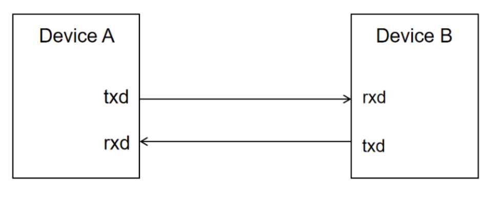
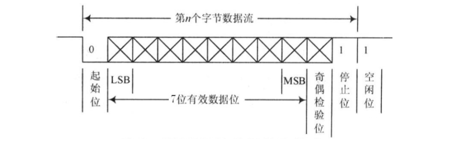
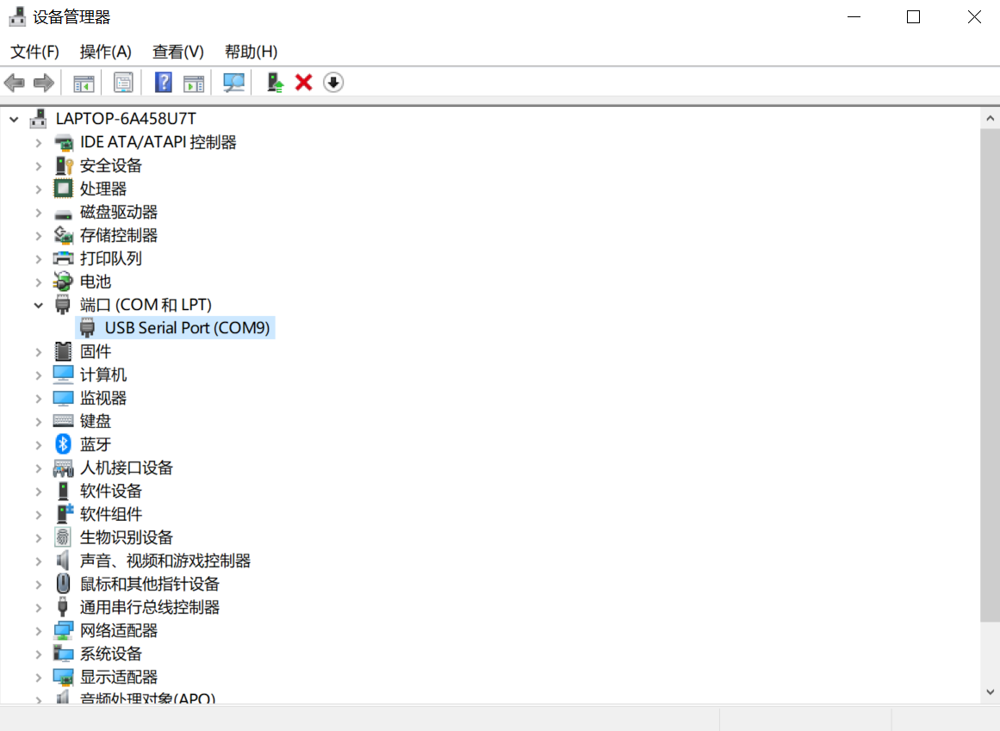
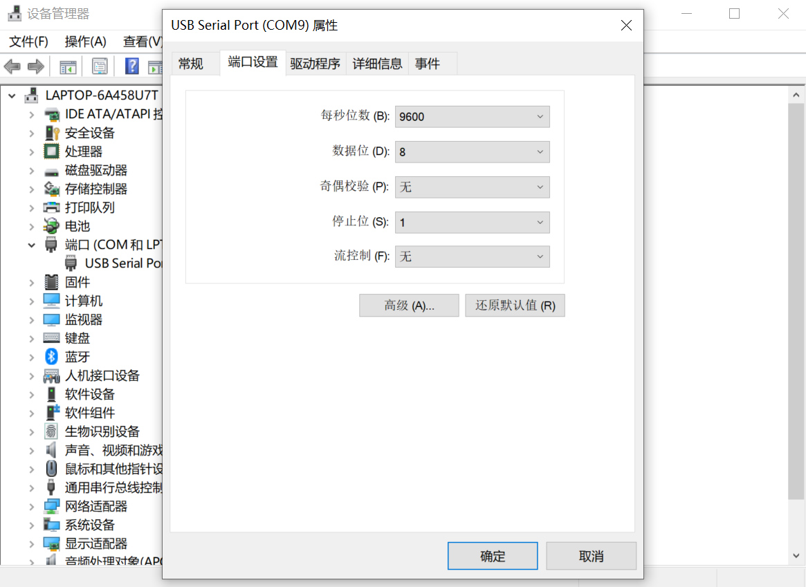
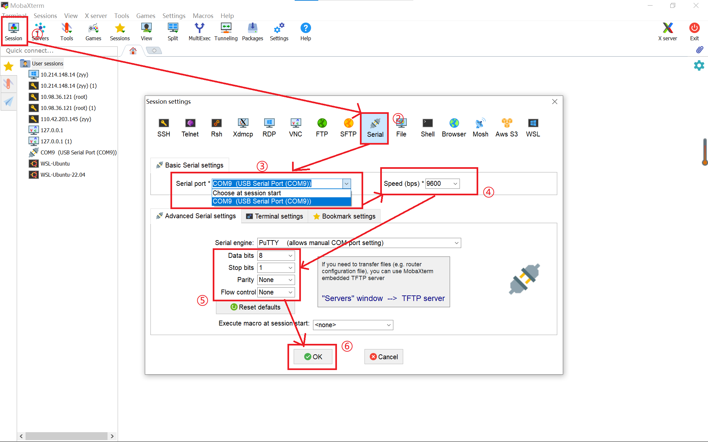
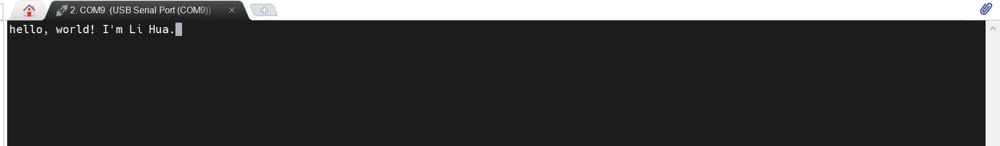

# 实验4-2: 串口使用（bonus）

## 实验目的

- 学习使用 SystemVerilog 的 interface 等高级语法
- 学习串口的原理和使用
- 学习 FIFO 的原理和使用

## 实验环境

- 操作系统：Windows 10+ 22H2，Ubuntu 22.04+
- VHDL：Verilog，SystemVerilog

## 背景知识

### uart 串口传输协议

uart（universal asynchronous receiver/transmitter）通用异步收发串口是一种低速、全双工、串行、异步数据传输设备。最简单的串口由两个引脚组成：

* txd：向外部设备发送数据
* rxd：接受收外部设备发送的数据

uart 串口数据线由两根线组成：一根连接 A 设备的 txd 和 B 设备的 rxd，负责将 A 的数据发送给 B；一根连接 A 设备的 rxd 和 B 设备的 txd，负责将 B 设备的数据发送给 A。从而实现设备 A 和设备 B 之间的双向交互。

{ width="500" }

uart 交互的双方并不依赖时钟进行同步，所以是异步传输的，它们共同遵守 uart 异步传输协议来确保传输的正确性。波特率（Baud Rate）用于描述串口传输的速率，例如波特率是 9600，则每秒传输 9600 个 bit 的数据，或者说每个被传输的数据会在数据线上维持 1/9600 s，常见的波特率有 9600、115200 等。

uart 每次传输一个字节的数据，他会根据协议将数据打包为一个位序列，然后通过数据线发送出去，每个位保持 1/baud s。数据线在不发送数据时保持高电平，当发送端需要发送数据时，首先发送一个单位时间的低电平，表示发送开始；然后将待发送数据从低到高依次发送到数据线上，每个位保持一个单位时间；最后发送一个单位时间的高电平表示发送结束。然后数据线回归高电平，直到下一次数据发送。

接收端恰恰相反，它时刻检查数据线上的电平，当遇到低电平时发现有数据传输，然后每隔一个单位时间做一次采样，依次将 8 个 bit 的传输数据采样拼接，得到完整的传输数据。

{ width="550" }

uart 数据传输格式如下：

* 起始位：1 bit
* 数据位：8 bit
* 奇偶校验位：0/1 bit（可选）
* 终止位：1/1.5/2 bit（可选）

### 串口使用

假设我们的 FPGA 板已经有了串口单元，那么我们要怎么使用上位机和 FPGA 板通过串口进行交互呢？

首先我们需要进行物理连线。因为 nexys-a7 开发板的 uart 口和 jtag 口共用一个端口、uart 传输线和 jtag 传输线共用一根数据线，所以我们将下板用的数据线连接 FPGA 和上位机的同时，已经完成了 uart 的数据线连接完毕。现在打开开发板电源，就可以在 windows 操作系统的设备管理器看到这个`USB Serial Port`设备。

{ width="570" }

双击这个`USB Serial Port`可以查看串口的配置属性，可以看到默认情况下串口波特率为 9600，数据位 8 位，没有奇偶校验位，停止位 1 位，没有流控制。如果需要其他配置可以在这里修改。

{ width="570" }

之后我们下载安装串口调试软件 [Mobaxterm](https://mobaxterm.mobatek.net/)。双击打开后，进行串口交互界面的配置:

* 点击 session 建立新的会话
* 点击 Serial 设置串口会话
* 选择 Serial Port 为开发板的端口
* 设置 Speed 为之前查到的默认值 9600
* 修改 Serial 其他配置和查到的默认值保持一致
    - Data Bit: 8
    - Stop Bit: 1
    - Pairty: None
    - Flow Control: None
* 点击 Ok 创建会话

之后如果串口发送数据，就可以在这个界面看到字符输出；点击会话界面敲击键盘，就可以向 FPGA 发送数据。如果上位机发送了数据，开发板的 TX 灯会闪烁，如果上位机接收到 FPGA 发送的数据，开发板的 RX 灯会闪烁。

